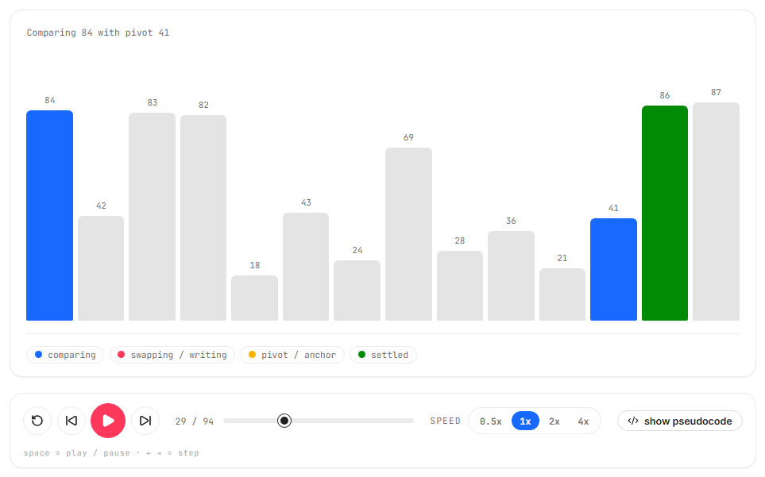
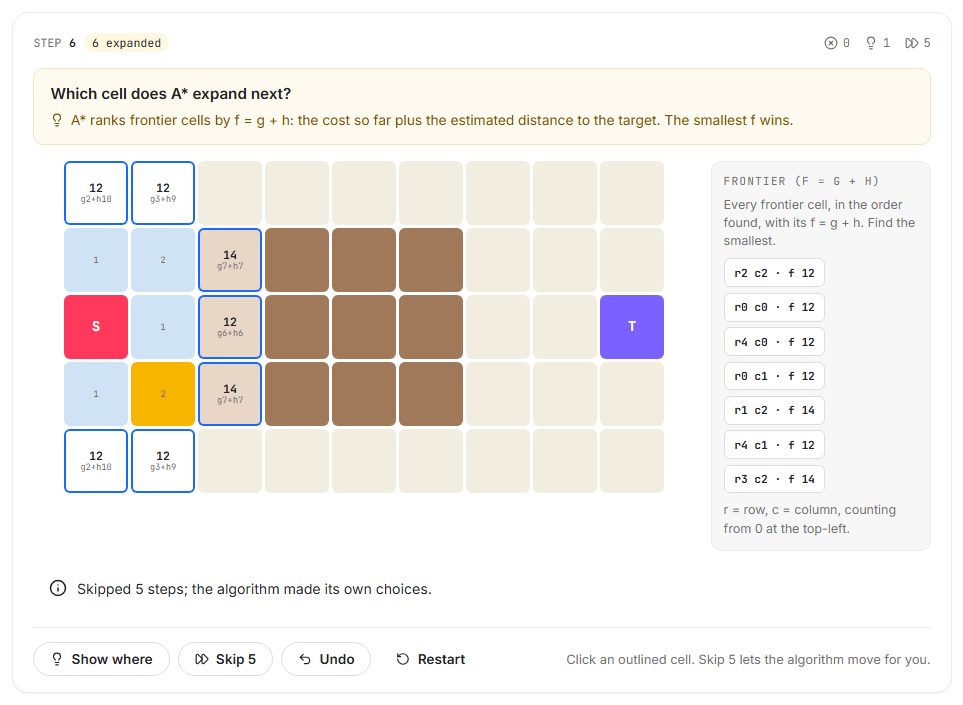
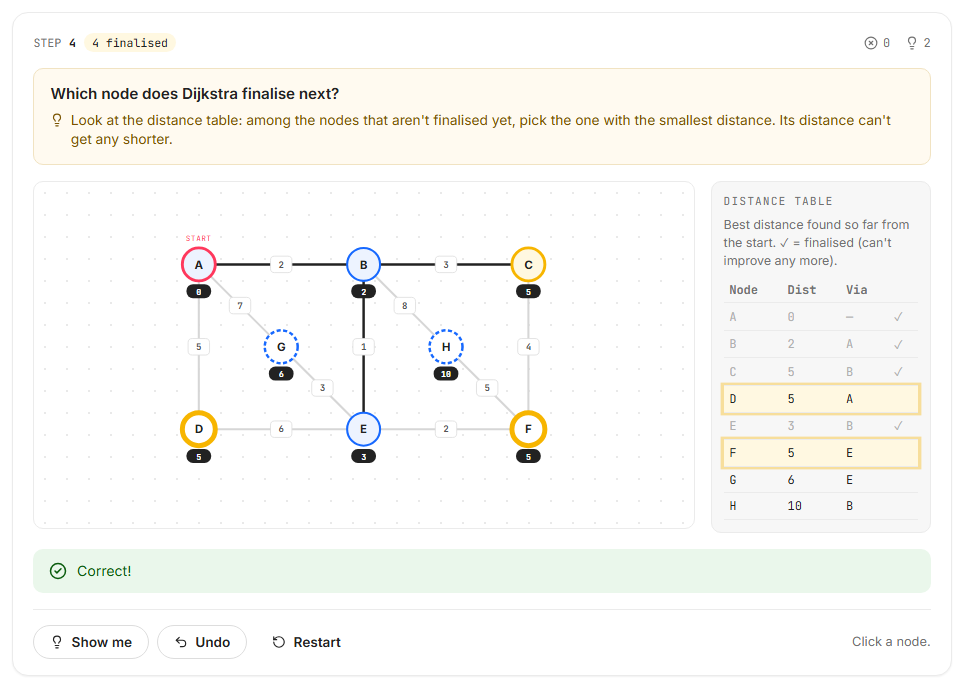

# SPIT Algo Visualizer

An algorithm visualizer for students learning data structures and algorithms. Watch 23 classic algorithms run one step at a time, then switch to **practice mode** and make each decision yourself. The app checks every move and explains mistakes.



<p align="center">
  
  
</p>

## Features

- **Watch mode.** Play, pause, step back and forward, scrub and change the speed (keyboard: Space, ← / →). Colours show what the algorithm is doing, and a filterable log lists every step in words.
- **Practice mode for every algorithm.** You make the decisions:

  | Topic | What you do in practice mode |
  |---|---|
  | Sorting | Rearrange the bars to match the end of each pass (Bubble, Selection, Insertion, Shell); pick the next merged value (Merge); place the pivot (Quick); choose the child to swap (Heap); drop values into digit buckets (Radix). |
  | Pathfinding | Click the cell the algorithm explores next, then trace the shortest path back (BFS, Dijkstra, A*). |
  | Graphs | Pick the next node (BFS, DFS, Dijkstra), fill in the distance table (Bellman-Ford), add or reject edges (Kruskal), pick the cheapest crossing edge (Prim), group nodes into SCCs (Tarjan). |
  | Backtracking | Place queens, fill Sudoku cells or colour nodes, and press **Backtrack** when nothing fits. |

  Any equally good move is accepted, and wrong moves are explained ("the queen at row 0, column 0 attacks this square diagonally"). Hints come in three steps: **Hint → Show where → Show me**. You can also undo, restart and skip ahead, and a summary at the end shows your mistakes and hints.
- **"How to read this" guides.** Every colour, number and term on screen (frontier, relax, f = g + h, SCC, …) is explained in plain language.
- **Your own inputs.** Type an array, draw walls and slow "mud" on the grid, or build a graph by clicking, dragging and editing weights, or by typing an edge list such as `A-B-5`.
- **Code tracer.** Pseudocode next to the animation, with the current line highlighted.
- **Complexity and quiz.** Best, average and worst case for every algorithm, with a growth-curve explanation, plus a quiz per topic.
- **AI tutor.** Ask about the algorithm and the step you're on (Google Gemini, through a server-side function). Answers are AI-generated and can be wrong.
- **Works on phones and with a keyboard.** Practice mode works by clicking or tapping; the bars, grid cells and graph nodes can also be used with Tab, the arrow keys and Enter.

## Algorithms (23)

| Topic | Algorithms |
|---|---|
| Sorting (8) | Bubble, Selection, Insertion, Shell, Merge, Quick, Heap, Radix |
| Pathfinding (5) | Breadth-First Search, Depth-First Search, Dijkstra, A*, Greedy Best-First |
| Graphs (7) | BFS, DFS, Dijkstra, Bellman-Ford, Kruskal's MST, Prim's MST, Tarjan's SCC |
| Backtracking (3) | N-Queens, Sudoku, Graph m-Colouring |

Open one directly with a link: `/algorithm?algo=astar`. Add `&mode=practice` to start in practice mode. The keys are in [src/data/algorithms.js](src/data/algorithms.js).

## Running it locally

Requires Node.js 18 or newer.

```bash
git clone https://github.com/Zaid5671/AlgoVisualizer.git
cd AlgoVisualizer
npm install
npm run dev          # http://localhost:5173
```

`npm run dev` runs everything except the AI tutor. The tutor needs the serverless function in [api/chat.js](api/chat.js), which keeps the API key on the server:

1. Copy `.env.example` to `.env` and set `GEMINI_API_KEY` (get a key at [aistudio.google.com/apikey](https://aistudio.google.com/apikey)). Never commit `.env`.
2. Install the Vercel CLI (`npm i -g vercel`) and run `vercel dev`. The app is then at http://localhost:3000.

When deploying to Vercel, add `GEMINI_API_KEY` under **Project → Settings → Environment Variables**.

### Other scripts

| Command | What it does |
|---|---|
| `npm run build` | Production build into `dist/` |
| `npm run lint` | Lint with oxlint |
| `npx playwright test` | End-to-end tests. `playwright.config.js` expects the app at http://localhost:3000 (`vercel dev`); change `baseURL` to use `npm run dev` instead. |
| `npm run screenshots` | Regenerates the landing-page screenshots in `public/landing/` from the running app (start `npm run dev` first). |

## How it works

Each algorithm in `src/algorithms/` is a plain function that runs the algorithm on the input and returns an **array of snapshots**, one per step: the data at that moment, which items are active, a message and the pseudocode line. The playback engine (`src/engine/`) only moves an index through that array, so stepping backwards or scrubbing is instant and the views simply render the current snapshot.

Practice mode is separate. Each topic has a pure **stepper engine** in `src/practice/` with `init`, `question`, `apply` and `auto` functions:
- `question` lists every answer that is correct right now, so ties are accepted;
- `apply` follows the learner's choice;
- `auto` is the algorithm's own move, used by "Show me" and "Skip 5".

A shared React hook (`usePracticeSession`) adds hints, undo, restart and scoring on top. Because the engines have no React code, they are checked in plain Node against independent reference implementations.

```text
src/
├── algorithms/   step generators for watch mode (sorting, pathfinding, graph, backtracking)
├── practice/     practice-mode engines and the usePracticeSession hook
├── engine/       playback engine, usePlayback hook, step types
├── graph/        graph editing, presets, text import and validation
├── components/   shared UI (playback bar, bar chart, grid, graph canvas, guides, dialogs, tutor)
├── views/        one view per topic, plus the landing page
├── data/         algorithm registry, quiz questions, puzzles, team info (site.js)
└── styles/       design tokens and page styles
api/chat.js       serverless proxy to Gemini (keeps the key server-side)
tests/            Playwright end-to-end tests
```

## Tech stack

React 19, Vite, React Router, lucide-react icons, plain CSS with design tokens, SVG for graphs, Playwright for tests, and a Vercel serverless function for the tutor.

## Team

Built by **Zaid Khan**, **Mohit Rohra** and **Afshaan Shaikh**, students of SPIT, as a mini-project.
